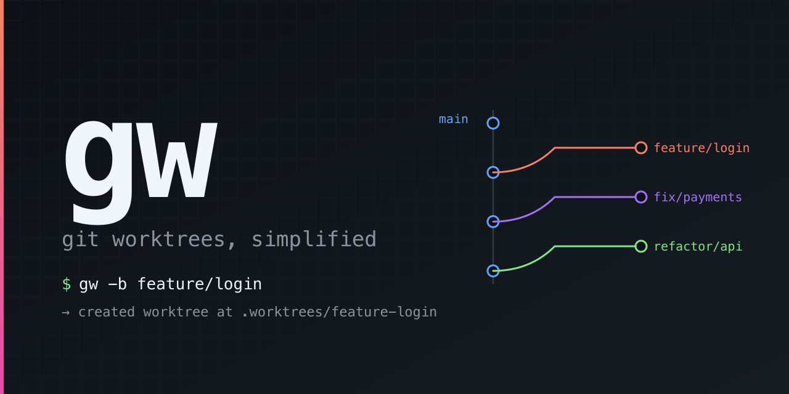

<div align="center">
  

  <p>
    <em>A tiny zsh helper that makes <a href="https://git-scm.com/docs/git-worktree">git worktrees</a> feel like switching tabs.</em>
  </p>

  <p>
    <a href="LICENSE"></a>
    
    
  </p>
</div>

---

## Why

Worktrees let you check out multiple branches at once — perfect for hopping between a feature, a hotfix review, and an agent's branch without stashing or cloning. The native CLI is just a bit clunky for everyday use:

```bash
git worktree add ../somewhere-else feature-x
cd ../somewhere-else
# ...later...
cd /path/to/main
git worktree remove ../somewhere-else
git branch -d feature-x
```

`gw` collapses that to:

```bash
gw -b feature-x   # create + cd in
gw -d feature-x   # remove + delete branch
```

All worktrees live under `<repo>/.worktrees/<branch>`, gitignored locally. You spend less time managing paths and more time writing code.

## Install

Clone once into `~/.claude/skills/gw/` and you get both the zsh helper and the [Claude Code skill](#claude-code-skill) in one go:

```bash
git clone https://github.com/ohwhen/gw.git ~/.claude/skills/gw
echo 'source ~/.claude/skills/gw/gw.zsh' >> ~/.zshrc
source ~/.zshrc
```

If you don't use Claude Code, clone anywhere and source `gw.zsh` from there — only the path changes.

### Updating

```bash
cd ~/.claude/skills/gw && git pull
```

Then `source ~/.zshrc` (or open a new shell) to load the new version.

## Usage

| Command | What it does |
|---|---|
| `gw` | List all worktrees |
| `gw <branch>` | Check out an existing branch in a worktree, `cd` into it |
| `gw -b <branch>` | Create a new branch + worktree, `cd` into it |
| `gw -d <branch>` | Remove worktree and delete branch (refuses if dirty or unmerged) |
| `gw -D <branch>` | Force-remove worktree and force-delete branch |
| `gw -r` | `cd` to the main worktree from anywhere in the repo |
| `gw -h`, `--help` | Show help |

Slashes in branch names get sanitized into the directory: `owen/foo` → `.worktrees/owen-foo`.

## How it works

- On first use in a repo, `gw` adds `.worktrees/` to `.git/info/exclude` (local-only — no committed change to the repo) and creates the directory.
- `gw <branch>` is idempotent. If the worktree already exists, it just `cd`s in.
- `-d` mirrors `git branch -d` semantics: refuses to delete unmerged branches or dirty worktrees. `-D` is the force variant.
- All operations run against the main repo via `git -C`, so it works correctly from inside any linked worktree too.

## Tab completion

Tab completion is included and is context-aware:

- `gw <Tab>` — branches that already have worktrees first, then all other local branches
- `gw -d <Tab>` / `gw -D <Tab>` — only branches that have a worktree (so you don't accidentally delete a random branch)
- `gw -b <Tab>` — all local branches as a reference (so you can avoid name collisions and follow your existing prefix conventions)

Requires `compinit` to be active (it is by default in oh-my-zsh, prezto, and most modern setups).

## Example session

A typical day: you're working on a feature, a teammate's PR review comes in, then you go back and finish.

**1. Start a new feature.**

```console
$ cd ~/code/myproject

$ gw -b owen/login-redesign
added .worktrees/ to /Users/me/code/myproject/.git/info/exclude
Preparing worktree (new branch 'owen/login-redesign')
HEAD is now at a1b2c3d main: bump version

$ pwd
/Users/me/code/myproject/.worktrees/owen-login-redesign
```

You're already in the new worktree. First time in this repo, `gw` set up `.worktrees/` in your local exclude.

**2. Teammate pings you for a PR review. You don't want to lose your in-progress edits — just spin up another worktree.**

```console
$ gw -b sara/payments-fix origin/sara/payments-fix
Preparing worktree (new branch 'sara/payments-fix')
HEAD is now at d4e5f6a Add retry on Stripe 5xx

$ # ...read the diff, leave comments, run the tests...

$ gw                            # see everything you've got going
/Users/me/code/myproject                                       a1b2c3d [main]
/Users/me/code/myproject/.worktrees/owen-login-redesign        b9c0d1e [owen/login-redesign]
/Users/me/code/myproject/.worktrees/sara-payments-fix          d4e5f6a [sara/payments-fix]
```

**3. Hop back to your feature. Tab completion knows which branches have worktrees and ranks them first.**

```console
$ gw owen/<Tab>
owen/login-redesign  -- worktree
owen/old-experiment  -- branch

$ gw owen/login-redesign
$ pwd
/Users/me/code/myproject/.worktrees/owen-login-redesign
```

**4. Push, open the PR, get it merged. Time to clean up. You're still inside the worktree — `gw -d` handles that.**

```console
$ git push -u origin owen/login-redesign
$ # ...PR merged on GitHub...

$ git fetch --prune
$ pwd
/Users/me/code/myproject/.worktrees/owen-login-redesign

$ gw -d owen/login-redesign
Deleted branch owen/login-redesign (was b9c0d1e).

$ pwd                           # gw cd'd you back to root before deleting
/Users/me/code/myproject
```

**5. Drop the review worktree the same way.**

```console
$ gw -d sara/payments-fix
Deleted branch sara/payments-fix (was d4e5f6a).

$ gw
/Users/me/code/myproject  a1b2c3d [main]
```

Back to a clean slate. No `cd`s memorized, no orphaned branches.

## Requirements

- zsh
- git 2.5 or newer

## Claude Code skill

This repo doubles as a [Claude Code skill](https://docs.claude.com/en/docs/claude-code/skills) — see [`SKILL.md`](SKILL.md). When you clone into `~/.claude/skills/gw/` (the [Install](#install) step above), Claude Code automatically picks up the skill. It teaches an agent the `.worktrees/` isolation pattern — when to use a worktree instead of stashing, the path conventions, and the raw `git worktree` commands to use in non-interactive contexts.

## License

[MIT](LICENSE)
